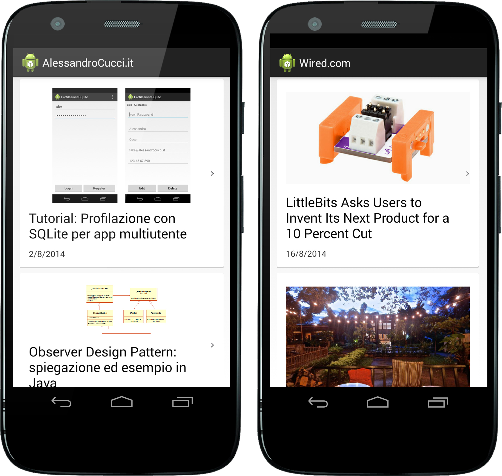

Wordpress Parser
=========

Semplice app Android per visualizzare gli ultimi post da un sito Wordpress.

  - Cards Layout
  - Visualizza titoli, date e, se presenti nella descrizione, immagini
  - Cliccando sul link viene aperto l'articolo nel Browser


Versione
----

1.0

To-Do
-----------

Prossimamente mi piacerebbe aggiungere:

* pagina in cui inserire l'url del sito e il numero massimo di post da visualizzare
* Parsing del titolo del sito in modo da modificare il titolo nella Barra in alto
* Fare il parsing del post senza aprire il browser
 

Settaggi
--------------

Nella MainActivity.java modificare queste due righe:
```sh
public final int MAX_POST = 10; //Numero massimo di post da visualizzare
public final String URL_FEED = "URL_DEL_SITO"; //Url del feed del sito wordpress
```
Nel file res/values/strings.xml modificate
```sh
<string name="app_name">Wordpress Parser</string> 
```
e inserite il nome che volete dare all'app (ad esempio il nome del sito)

Licenza
----

Fate come se fosse codice vostro!

Ringraziamenti
----
Koush e la sua [UrlImageViewHelper](https://github.com/koush/UrlImageViewHelper)

Screenshot
----


