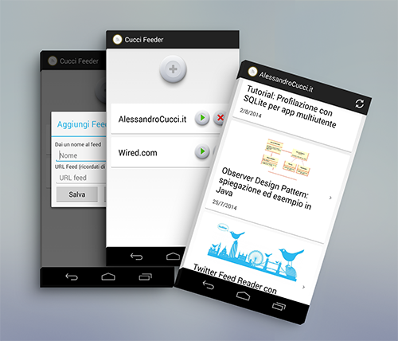

Cucci Feeder
=========

Semplice app Android per visualizzare gli ultimi feed RSS.

  - Cards Layout
  - Visualizza titoli, date e, se presenti nella descrizione, immagini
  - Cliccando sul link viene aperto l'articolo nel Browser

Versione
----

1.1

To-Do
-----------

Prossimamente mi piacerebbe aggiungere:

* Fare il parsing del post senza aprire il browser
 

Ringraziamenti
----
Koush e la sua [UrlImageViewHelper](https://github.com/koush/UrlImageViewHelper)

Screenshot
----

